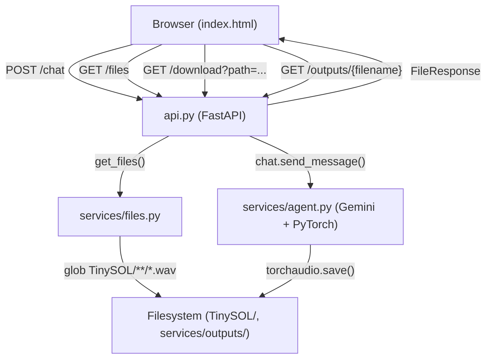

# Design Document: Distort-o-Matic Frontend

## Overview

Distort-o-Matic Frontend is a single-page web application that presents the Distort-o-Matic audio distortion ML project. It consists of two deliverables:

1. **`api.py`** — a FastAPI server that bridges the browser to the existing `services/agent.py` Gemini-powered chatbot, exposing REST endpoints for chat, file listing, and audio download.
2. **`index.html`** — a self-contained single-page application (HTML + CSS + vanilla JS) with a glass-morphism light-pink UI, three sections (hero, model gallery, chatbot), and `fetch()`-based communication with the API bridge.

The design deliberately avoids heavy frontend frameworks (React, Vue, etc.) and keeps the backend minimal — `api.py` is a thin proxy layer; all ML logic stays in `services/agent.py`.

---

## Architecture



The browser never touches `agent.py` directly. All API keys and ML model state live server-side. The FastAPI app maintains a single `chat` session object for the lifetime of the server process, preserving conversation history across requests.

---

## Components and Interfaces

### api.py (FastAPI Bridge)

Responsible for:
- Hosting the four REST endpoints
- Holding the singleton `chat` session imported from `services/agent.py`
- Serving static output images via `/outputs/{filename}`
- Path-traversal protection on `/download`

**Endpoints:**

| Method | Path | Description |
|--------|------|-------------|
| POST | `/chat` | Forward message to agent, return reply |
| GET | `/files` | Return list of available .wav files |
| GET | `/download` | Stream a processed .wav file |
| GET | `/outputs/{filename}` | Serve a static image from `services/outputs/` |

**CORS:** `CORSMiddleware` configured to allow all origins during development (tightened for production).

### index.html (Single-Page Frontend)

Three logical sections rendered in a single HTML file with embedded `<style>` and `<script>` blocks:

1. **Hero Section** — project name, description paragraph, tech stack badges
2. **Model Gallery** — three image cards (Fuzz, SoftClip, WaveFolding) with labels and descriptions
3. **Chatbot UI** — file selector, message history, input bar, send button

All API communication uses the browser `fetch()` API. No build step required.

---

## Data Models

### POST /chat

Request:
```json
{ "message": "string" }
```

Response (200):
```json
{ "reply": "string" }
```

Response (500):
```json
{ "error": "string" }
```

### GET /files

Response (200):
```json
["TinySOL/Brass/Horn/ordinario/Hn-ord-A2-ff-N-N.wav", "..."]
```

### GET /download?path=\<encoded_path\>

Response (200): `audio/wav` binary stream

Response (404):
```json
{ "error": "File not found" }
```

Response (400):
```json
{ "error": "Invalid path" }
```

### GET /outputs/{filename}

Response (200): `image/png` binary stream (served via `FileResponse`)

Response (404): FastAPI default 404

### Frontend State (in-memory JS)

```js
{
  selectedFile: String | null,       // currently selected .wav path
  messages: [                        // chat history
    { role: "user" | "agent", text: String, downloadPath: String | null }
  ],
  isLoading: Boolean
}
```

---

## Correctness Properties

*A property is a characteristic or behavior that should hold true across all valid executions of a system — essentially, a formal statement about what the system should do. Properties serve as the bridge between human-readable specifications and machine-verifiable correctness guarantees.*

### Property 1: Chat forwarding round-trip

*For any* non-empty message string, when `POST /chat` is called with that message, the API bridge SHALL call the agent's `send_message()` with that exact message and return its text response in the `reply` field.

**Validates: Requirements 3.2**

### Property 2: Conversation session is preserved

*For any* sequence of N messages sent to `POST /chat`, the same chat session object SHALL handle all N messages (i.e., `send_message` is called N times on the same session, not on N freshly created sessions).

**Validates: Requirements 3.3**

### Property 3: File list pass-through

*For any* list of file paths returned by `get_files()`, the `GET /files` endpoint SHALL return that exact list as a JSON array.

**Validates: Requirements 4.1**

### Property 4: Valid audio file is served

*For any* `.wav` file path that exists within the project directory, `GET /download?path=<path>` SHALL return a binary response with `Content-Type: audio/wav`.

**Validates: Requirements 5.2**

### Property 5: Path traversal is rejected

*For any* path string that resolves outside the project root (e.g., contains `../`, absolute paths, or URL-encoded traversal sequences), `GET /download` SHALL return a 400 or 403 response and SHALL NOT serve any file content.

**Validates: Requirements 5.4**

### Property 6: User message appears in chat history

*For any* non-empty message string submitted via the chat input, the message SHALL appear in the rendered message history before the API response is received.

**Validates: Requirements 6.2**

### Property 7: Agent reply appears in chat history

*For any* reply string returned by a mocked `POST /chat` response, that reply text SHALL appear in the rendered message history after the response is received.

**Validates: Requirements 6.4**

### Property 8: File selector reflects available files

*For any* list of file paths returned by a mocked `GET /files` response, the file selector element SHALL contain exactly those paths as selectable options.

**Validates: Requirements 7.1**

### Property 9: Selected file is included in chat message context

*For any* file path selected in the file selector, the body of the subsequent `POST /chat` request SHALL include that file path so the agent can reference it.

**Validates: Requirements 7.2**

### Property 10: Processed file triggers download button

*For any* agent reply string that contains a substring matching `*_processed.wav`, the Chatbot_UI SHALL render a download button whose `href` points to `GET /download?path=<extracted_path>`.

**Validates: Requirements 7.3**

### Property 11: Color contrast meets WCAG AA

*For any* text/background color pair defined in the CSS design tokens, the WCAG contrast ratio SHALL be ≥ 4.5:1.

**Validates: Requirements 8.3**

---

## Error Handling

| Scenario | Component | Behavior |
|----------|-----------|----------|
| Agent raises exception | `api.py` `/chat` | Catch, return `{"error": str(e)}` with HTTP 500 |
| Requested download file not found | `api.py` `/download` | Return `{"error": "File not found"}` with HTTP 404 |
| Path traversal attempt on `/download` | `api.py` `/download` | Return `{"error": "Invalid path"}` with HTTP 400 |
| `GET /files` fetch fails in browser | `index.html` JS | Log error, show empty selector with placeholder text |
| `POST /chat` fetch fails in browser | `index.html` JS | Append inline error bubble to message history; do not clear history |
| Gallery image fails to load | `index.html` HTML | `onerror` handler swaps `src` to a CSS-styled placeholder div |

---

## Testing Strategy

This feature is a combination of a FastAPI backend and a vanilla JS frontend. Property-based testing applies to the backend API logic (pure forwarding/validation functions) and to the frontend's DOM-manipulation logic. UI rendering, CSS design, and visual aesthetics are tested via example-based and snapshot approaches.

### Backend (api.py) — pytest + hypothesis

- **Property tests** (hypothesis): Properties 1–5 above. Mock `services/agent.chat` and `services/files.get_files` to isolate the bridge logic.
- **Example-based tests**: CORS header presence, `/outputs/{filename}` serving, HTTP 404 for missing files.
- **Edge case tests**: Agent exception → 500, missing file → 404, path traversal → 400.

Each property test runs a minimum of 100 iterations via hypothesis `@given` decorator.

Tag format: `# Feature: distort-o-matic-frontend, Property {N}: {property_text}`

### Frontend (index.html) — Jest + jsdom (or Playwright for integration)

- **Property tests** (fast-check): Properties 6–10. Use jsdom to render the page, mock `fetch`, and drive arbitrary inputs.
- **Example-based tests**: Page load shows all three sections, loading indicator appears during pending fetch, Enter key submits message, dark-mode CSS variables change.
- **Snapshot tests**: Gallery renders three image cards with correct labels.
- **Contrast test** (Property 11): Parse CSS custom properties, compute WCAG contrast ratios programmatically.

### Test Configuration

```
Backend:  pytest --hypothesis-seed=0 (reproducible), min_examples=100
Frontend: jest --runInBand (jsdom), fast-check numRuns=100
```
